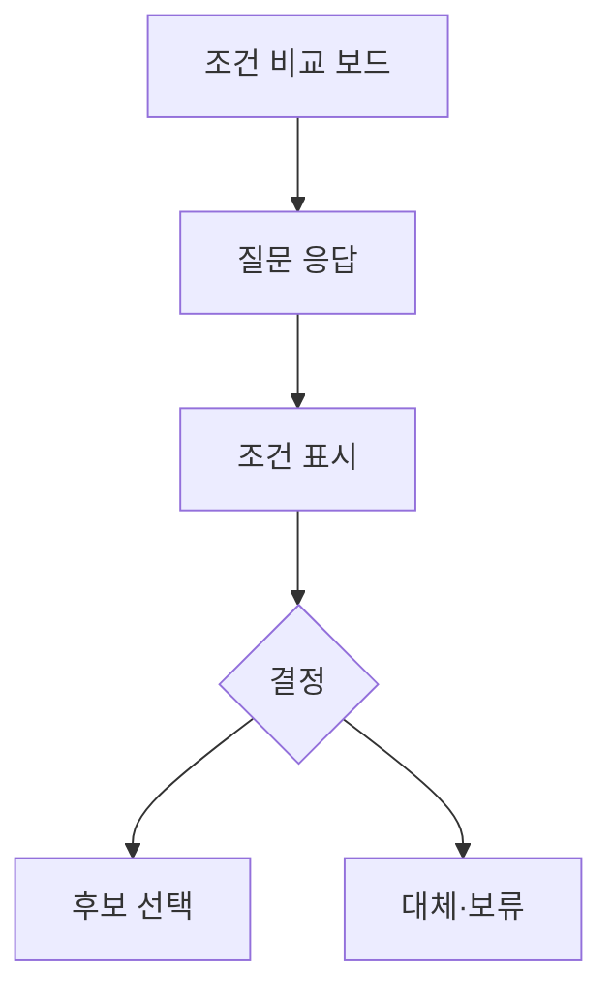

# VC-34 하윤 사이트구조맵 B안 V3 — 조건 비교 보드형

## 1. Client·REQ 추적
- Client: VC-34 하윤, REQ-034.
- 수용 조건: 추천 대신 질문과 안전한 대체 후보를 얻는다.
- 연결 제품: PROD-023 — 접근성 확인 선물 패키지 / PROD-052 — 선물 확인 질문 카드 / PROD-053 — 조작 조건 비교 패키지 / PROD-091 — 대체 조작 선물 안내.

## 2. 구조 전략
- 후보를 조작 방식·포장·사용 조건·미확인 정보의 열로 비교한다.
- 정보 부족 셀은 모름으로 표시하고 자동 추천을 막는다.

## 3. 페이지·콘텐츠·기능 계약
- PAGE-007 질문 보드, PAGE-008 후보 비교, PAGE-014 패키지, PAGE-021 보류.
- 확인·모름·대체·복귀를 각 행에서 선택한다.

## 4. 사용자 흐름·상태
- 비교 보드 → 질문 응답 → 조건 표시 → 선택/대체/보류.
- 상태: 비교 중, 확인, 미확인, 충돌, 대체, 복귀.

## 5. 중복·끊김·가정 검증
- `누구나 사용` 같은 표현을 금지하고 출처 없는 접근성 주장을 표시하지 않는다.
- 대체 후보도 동일한 검증 기준을 적용한다.

## 6. Mermaid

## 7. 판정
- HOLD / HYPOTHESIS: 조건별 근거를 확인한 뒤에만 선택을 허용한다.

