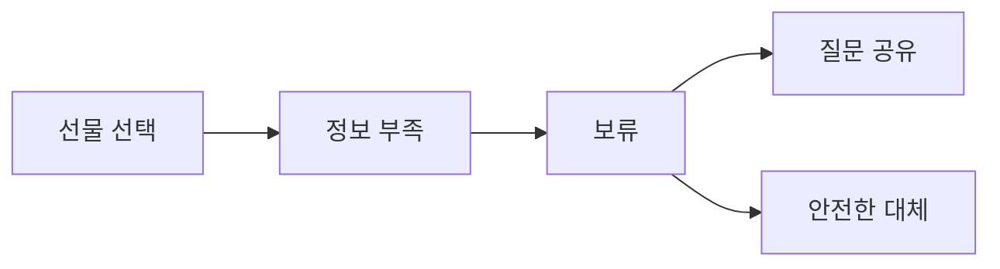

# VC-34 하윤 사이트구조맵 C안 V3 — 보류 우선 선물형

## 1. Client·REQ 추적
- Client: VC-34 하윤, REQ-034.
- 실패 조건: 누구나 사용, 능력 추정, 접근성 보장을 주장한다.
- 연결 제품: PROD-023 — 접근성 확인 선물 패키지 / PROD-052 — 선물 확인 질문 카드 / PROD-053 — 조작 조건 비교 패키지 / PROD-091 — 대체 조작 선물 안내.

## 2. 구조 전략
- 수령자 정보가 없으면 보류를 정상 경로로 두고 확인 질문을 통해 다음 행동을 안내한다.
- 대체 후보는 근거와 제한을 함께 표시한다.

## 3. 페이지·콘텐츠·기능 계약
- PAGE-007 확인 질문, PAGE-008 후보, PAGE-014 패키지, PAGE-021 보류·복귀.
- 미확인 라벨, 원문 보기, 재질문, 취소·복귀를 제공한다.

## 4. 사용자 흐름·상태
- 선물 선택 → 정보 부족 → 보류 → 질문 공유 또는 대체 후보 확인.
- 상태: 정보 부족, 질문 대기, 대체, 보류, 선택, 오류·HOLD.

## 5. 중복·끊김·가정 검증
- 보류 상태에서도 선물 목적과 확인해야 할 조건을 보존한다.
- 접근성 효과를 수치·보장 문구로 확정하지 않는다.

## 6. Mermaid

## 7. 판정
- HOLD / HYPOTHESIS: 불확실한 접근성은 보류하고 확인 후 재개한다.

