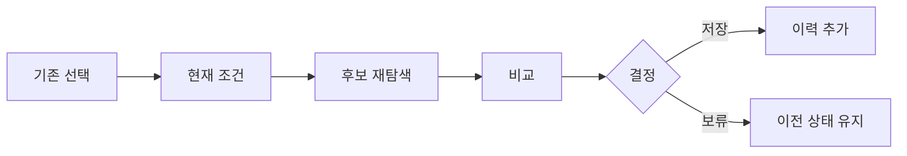

# VC-35 시온 사이트구조맵 A안 V3 — 조건 재선택형

## 1. Client·REQ 추적
- Client: VC-35 시온(생활 변화에 따른 방식 수정), REQ-035.
- 요구: 이전 선택을 보존하면서 현재 생활 조건으로 다시 판단한다.
- 연결 제품: PROD-036 — 일정 변경 이력 리필 / PROD-040 — 일과 변화 기록 템플릿 / PROD-068 — 일정 조건 재선택 패드 / PROD-074 — 프로젝트 회고 템플릿.

## 2. 구조 전략
- 기존 선택·현재 조건·새 후보를 분리하고 자동 덮어쓰기를 금지한다.
- 성향 점수나 고정 유형으로 변경을 막지 않는다.

## 3. 페이지·콘텐츠·기능 계약
- PAGE-002 기존 설정, PAGE-003 조건 재선택, PAGE-021 비교·이력.
- 이전 후보 유지, 새 조건 입력, 변경 미리보기, 저장·되돌리기 제공.

## 4. 사용자 흐름·상태
- 기존 선택 확인 → 현재 조건 입력 → 후보 재탐색 → 비교 → 저장/보류.
- 상태: 이전 유지, 재선택 중, 변경 예정, 저장, 되돌림, 오류.

## 5. 중복·끊김·가정 검증
- 변경 이력과 생활 템플릿은 각각 기록과 조건 입력 역할을 갖는다.
- 이전 결과는 삭제하지 않고 버전으로 보관한다.

## 6. Mermaid

## 7. 판정
- KEEP / INFERENCE: 생활 변화에 따른 재선택과 이전 기록 보존을 함께 유지한다.

