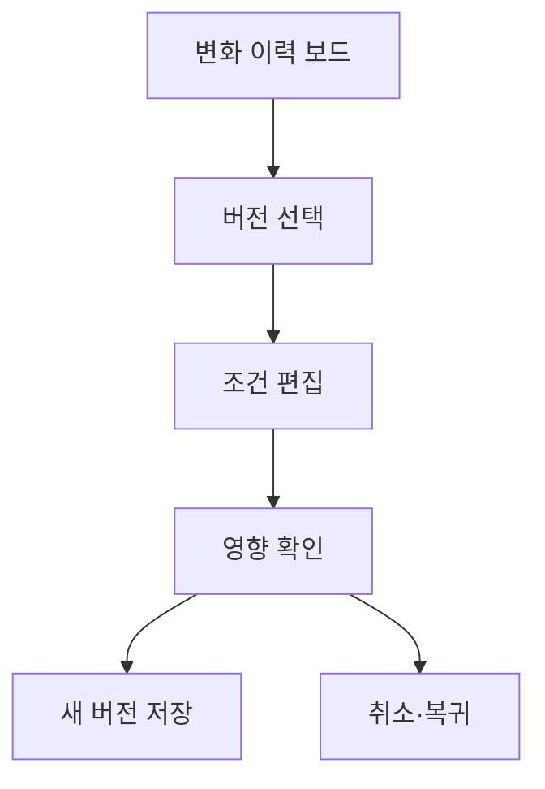

# VC-35 시온 사이트구조맵 B안 V3 — 변화 이력 보드형

## 1. Client·REQ 추적
- Client: VC-35 시온, REQ-035.
- 수용 조건: 이전 선택을 삭제하지 않고 현재 생활에 맞게 다시 판단한다.
- 연결 제품: PROD-036 — 일정 변경 이력 리필 / PROD-040 — 일과 변화 기록 템플릿 / PROD-068 — 일정 조건 재선택 패드 / PROD-074 — 프로젝트 회고 템플릿.

## 2. 구조 전략
- 이력 보드에 과거 조건·현재 조건·변경 이유를 나란히 보여준다.
- 사용자가 새 버전을 만들며 이전 버전은 읽기 전용으로 유지한다.

## 3. 페이지·콘텐츠·기능 계약
- PAGE-002 이력, PAGE-003 재선택, PAGE-021 비교.
- 버전 생성, 조건 편집, 영향 확인, 취소·복귀를 제공한다.

## 4. 사용자 흐름·상태
- 이력 보드 → 버전 선택 → 조건 편집 → 영향 확인 → 새 버전 저장.
- 상태: 읽기 전용, 편집 중, 검토 필요, 저장, 보류, 오류.

## 5. 중복·끊김·가정 검증
- 일정 조건 패드는 재선택 입력이며 회고 템플릿은 변화 이유 기록이다.
- 자동 폐기·자동 덮어쓰기 없이 버전 간 관계를 표시한다.

## 6. Mermaid

## 7. 판정
- KEEP / INFERENCE: 과거와 현재를 병렬 비교해 변경의 주도권을 사용자에게 둔다.

