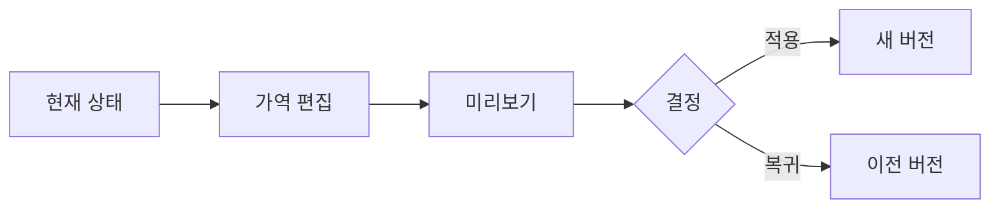

# VC-35 시온 사이트구조맵 C안 V3 — 가역 변경 안전형

## 1. Client·REQ 추적
- Client: VC-35 시온, REQ-035.
- 실패 조건: 성향 점수로 변경을 막거나 이전 결과를 자동 폐기한다.
- 연결 제품: PROD-036 — 일정 변경 이력 리필 / PROD-040 — 일과 변화 기록 템플릿 / PROD-068 — 일정 조건 재선택 패드 / PROD-074 — 프로젝트 회고 템플릿.

## 2. 구조 전략
- 변경은 언제든 되돌릴 수 있는 새 버전으로 저장하고 과거 결과를 삭제하지 않는다.
- 추천은 참고용이며 선택·초기화는 사용자 확인 후 실행한다.

## 3. 페이지·콘텐츠·기능 계약
- PAGE-002 기본 상태, PAGE-003 가역 편집, PAGE-021 버전 비교.
- 적용 전 확인, 저장, 이전 버전 복귀, 취소·복귀를 계약한다.

## 4. 사용자 흐름·상태
- 현재 상태 → 가역 편집 → 미리보기 → 적용/복귀.
- 상태: 초안, 확인 필요, 새 버전, 이전 복귀, 보류, 오류·HOLD.

## 5. 중복·끊김·가정 검증
- 회고 템플릿은 이유를 기록하지만 변경을 강제하지 않는다.
- 자동 성향 판정·폐기는 하지 않는다.

## 6. Mermaid

## 7. 판정
- KEEP / INFERENCE: 변경 가능성과 이전 결과 보존을 가역 버전으로 구현한다.

