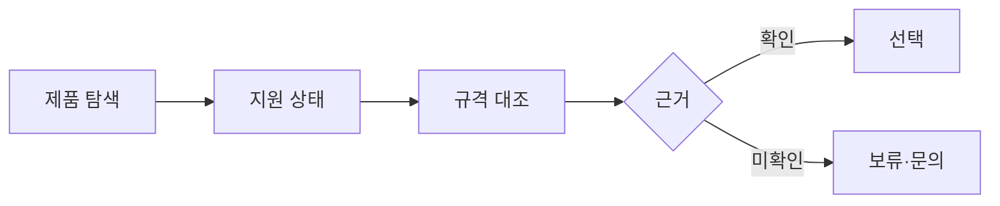

# VC-36 나윤 사이트구조맵 A안 V3 — 현재 지원 분리형

## 1. Client·REQ 추적
- Client: VC-36 나윤(리필·수리 가능성), REQ-036.
- 요구: 실제 지원과 향후 목표를 분리하고 수리·내구를 추정하지 않는다.
- 연결 제품: PROD-026 — 리필·수리 상태 가이드 / PROD-055 — 리필 규격 비교표 / PROD-057 — 장기 사용 점검 카드 / PROD-094 — 수리 지원 상태 카드 / PROD-095 — 리필 교체 기록지.

## 2. 구조 전략
- 현재 지원, 계획, 미확인을 별도 상태로 표시한다.
- 내구 연수·부품 호환·수리 가능성은 근거 없으면 보류한다.

## 3. 페이지·콘텐츠·기능 계약
- PAGE-007 제품 조건, PAGE-008 비교, PAGE-014 지원 안내, PAGE-020 관리, PAGE-021 보류.
- 확인일·출처·리필 규격·수리 상태·문의 경로를 제공한다.

## 4. 사용자 흐름·상태
- 제품 탐색 → 지원 상태 확인 → 규격 대조 → 선택/보류.
- 상태: 지원, 계획, 미확인, 규격 불일치, 문의, 오류.

## 5. 중복·끊김·가정 검증
- 교체 기록지는 사용 이력이며 수리 보장을 뜻하지 않는다.
- 점검 카드는 관리 안내이고 내구 연수를 확정하지 않는다.

## 6. Mermaid

## 7. 판정
- KEEP / INFERENCE: 현재 가능한 관리와 미래 목표를 명확히 분리한다.

