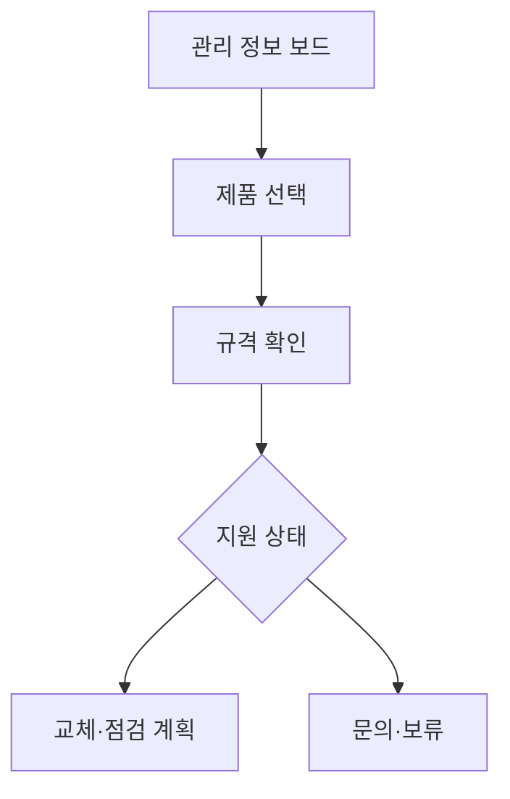

# VC-36 나윤 사이트구조맵 B안 V3 — 관리 정보 보드형

## 1. Client·REQ 추적
- Client: VC-36 나윤, REQ-036.
- 수용 조건: 현재 가능한 관리와 미래 목표를 혼동하지 않는다.
- 연결 제품: PROD-026 — 리필·수리 상태 가이드 / PROD-055 — 리필 규격 비교표 / PROD-057 — 장기 사용 점검 카드 / PROD-094 — 수리 지원 상태 카드 / PROD-095 — 리필 교체 기록지.

## 2. 구조 전략
- 제품별 리필·수리·점검·미확인 정보를 한 보드에서 비교한다.
- 출처 없는 호환성·내구성 문구는 표시하지 않는다.

## 3. 페이지·콘텐츠·기능 계약
- PAGE-007 정보 입력, PAGE-008 비교 보드, PAGE-014 지원, PAGE-020 관리, PAGE-021 보류.
- 상태 배지, 규격, 확인일, 문의·복귀를 제공한다.

## 4. 사용자 흐름·상태
- 관리 보드 → 제품 선택 → 규격 확인 → 교체·점검 계획 또는 보류.
- 상태: 확인됨, 부분 확인, 미확인, 교체 예정, 수리 문의, 복귀.

## 5. 중복·끊김·가정 검증
- 상태 가이드와 지원 카드는 현재 상태만 설명한다.
- 미래 목표는 계획으로만 표시하고 현재 지원과 섞지 않는다.

## 6. Mermaid

## 7. 판정
- KEEP / INFERENCE: 제품별 지원 근거와 미확인 범위를 병렬로 보여준다.

