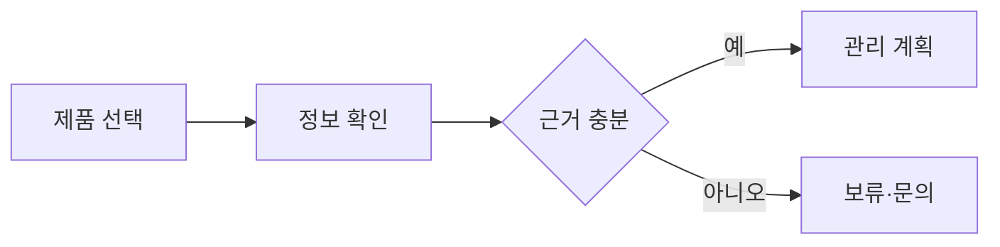

# VC-36 나윤 사이트구조맵 C안 V3 — 보류 우선 안전형

## 1. Client·REQ 추적
- Client: VC-36 나윤, REQ-036.
- 실패 조건: 수리 가능성·내구 연수·부품 호환을 임의 확정한다.
- 연결 제품: PROD-026 — 리필·수리 상태 가이드 / PROD-055 — 리필 규격 비교표 / PROD-057 — 장기 사용 점검 카드 / PROD-094 — 수리 지원 상태 카드 / PROD-095 — 리필 교체 기록지.

## 2. 구조 전략
- 정보가 부족하면 제품 선택을 보류하고 확인할 질문과 문의 경로를 안내한다.
- 확인된 관리 행동만 권장한다.

## 3. 페이지·콘텐츠·기능 계약
- PAGE-007 지원 질문, PAGE-008 후보, PAGE-014 수리·리필, PAGE-020 점검, PAGE-021 보류.
- 미확인 라벨, 원문 보기, 재확인, 취소·복귀를 제공한다.

## 4. 사용자 흐름·상태
- 제품 선택 → 정보 부족 → 보류 → 확인 후 재개.
- 상태: 미확인, 문의 필요, 보류, 확인, 선택, 오류·HOLD.

## 5. 중복·끊김·가정 검증
- 교체 기록은 이력만 남기며 부품 호환을 보장하지 않는다.
- 목표 상태와 현재 상태를 별도 타임라인으로 유지한다.

## 6. Mermaid

## 7. 판정
- HOLD / HYPOTHESIS: 불확실한 수리·내구 정보는 보류하고 확인 후 진행한다.

