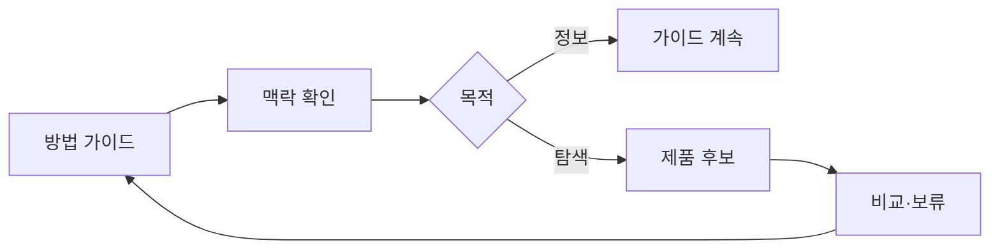

# VC-37 태윤 사이트구조맵 A안 V3 — 정보·제품 분리형

## 1. Client·REQ 추적
- Client: VC-37 태윤(콘텐츠와 제품 탐색 구분), REQ-037.
- 요구: 방법 안내와 제품 후보를 분리해 광고 오인을 차단한다.
- 연결 제품: PROD-010 — 독서·음악 기록 리필 묶음 / PROD-018 — 테마 독립 표현 보관함 / PROD-041 — 음악 감상 장면 카드 / PROD-073 — 영화 장면 기록 카드 / PROD-084 — 표현·기능 분리 라벨.

## 2. 구조 전략
- 가이드는 방법·맥락을 제공하고 제품 영역은 별도 라벨과 목적을 가진다.
- 구매 CTA를 강제하지 않고 가이드로 되돌아가는 경로를 고정한다.

## 3. 페이지·콘텐츠·기능 계약
- PAGE-016 방법 가이드, PAGE-020 관련 콘텐츠, PAGE-021 제품 후보·비교.
- 현재 목적, 제품 여부, 비교·보류, 원문 복귀를 표시한다.

## 4. 사용자 흐름·상태
- 가이드 → 방법 확인 → 관련 방식/제품 보기 → 가이드 복귀.
- 상태: 정보 보기, 제품 탐색, 비교, 보류, 복귀, 오류.

## 5. 중복·끊김·가정 검증
- 표현·기능 라벨은 콘텐츠와 제품 기능을 구분하는 표식이다.
- 장면 카드는 방법 예시일 수 있으므로 구매 추천으로 해석하지 않는다.

## 6. Mermaid

## 7. 판정
- KEEP / INFERENCE: 정보 목적과 제품 탐색 목적을 명확히 분리한다.

