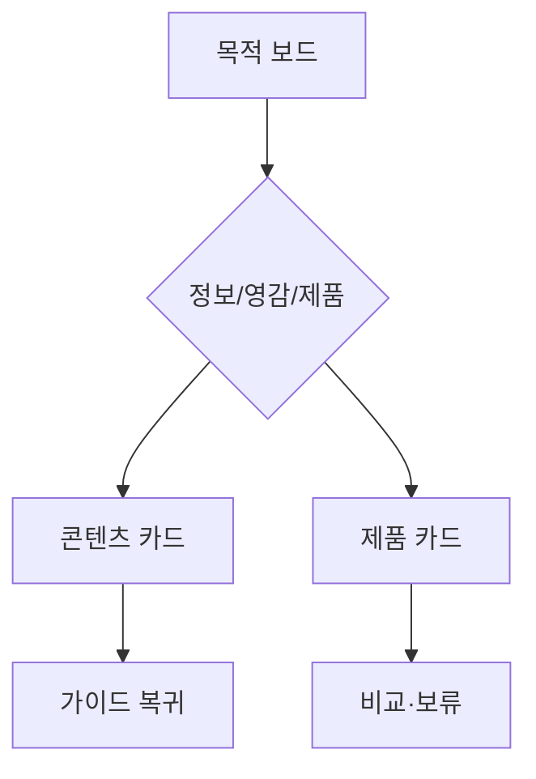

# VC-37 태윤 사이트구조맵 B안 V3 — 목적 전환 보드형

## 1. Client·REQ 추적
- Client: VC-37 태윤, REQ-037.
- 수용 조건: 현재 정보가 방법인지 제품 후보인지 설명한다.
- 연결 제품: PROD-010 — 독서·음악 기록 리필 묶음 / PROD-018 — 테마 독립 표현 보관함 / PROD-041 — 음악 감상 장면 카드 / PROD-073 — 영화 장면 기록 카드 / PROD-084 — 표현·기능 분리 라벨.

## 2. 구조 전략
- 목적 전환 보드에서 정보·영감·제품 비교를 명시적으로 선택한다.
- 선택하지 않은 CTA는 노출하지 않고 보류·복귀를 제공한다.

## 3. 페이지·콘텐츠·기능 계약
- PAGE-016 가이드, PAGE-020 영감, PAGE-021 제품 비교.
- 카드마다 목적, 근거, 상업성 표시, 원문 보기, 취소를 둔다.

## 4. 사용자 흐름·상태
- 목적 보드 → 콘텐츠 카드 → 제품 카드(선택 시) → 비교 또는 복귀.
- 상태: 정보, 영감, 제품, 비교 중, 보류, 오류.

## 5. 중복·끊김·가정 검증
- 관련 제품은 탐색 대상이지 가이드의 필수 결론이 아니다.
- 제품 카드와 콘텐츠 카드는 목적 라벨로 구분한다.

## 6. Mermaid

## 7. 판정
- KEEP / INFERENCE: 목적 전환을 사용자 선택으로 제한해 광고 오인을 막는다.

