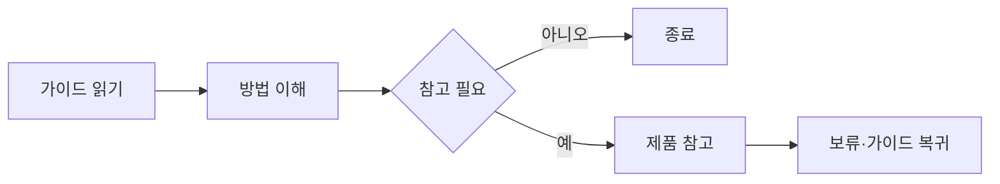

# VC-37 태윤 사이트구조맵 C안 V3 — 비판매 가이드 우선형

## 1. Client·REQ 추적
- Client: VC-37 태윤, REQ-037.
- 실패 조건: 가이드를 광고·구매 추천으로 바꾸거나 CTA를 강제한다.
- 연결 제품: PROD-010 — 독서·음악 기록 리필 묶음 / PROD-018 — 테마 독립 표현 보관함 / PROD-041 — 음악 감상 장면 카드 / PROD-073 — 영화 장면 기록 카드 / PROD-084 — 표현·기능 분리 라벨.

## 2. 구조 전략
- 가이드를 독립 정보로 완결하고 제품은 선택적 참고 영역에 둔다.
- 제품을 보지 않아도 핵심 방법을 이해할 수 있게 한다.

## 3. 페이지·콘텐츠·기능 계약
- PAGE-016 가이드 본문, PAGE-020 참고 콘텐츠, PAGE-021 선택적 제품 목록.
- 광고성 문구 차단, 제품 숨기기, 원문 복귀, 보류를 제공한다.

## 4. 사용자 흐름·상태
- 가이드 읽기 → 방법 이해 → 필요 시 제품 참고 → 종료/복귀.
- 상태: 가이드 완료, 참고 열기, 제품 보류, 복귀, 오류·HOLD.

## 5. 중복·끊김·가정 검증
- 제품 카드는 방법을 대체하지 않으며 구매를 유도하는 확정 문구를 쓰지 않는다.
- 장면·표현 카드는 콘텐츠 맥락과 기능 정보를 분리한다.

## 6. Mermaid

## 7. 판정
- KEEP / INFERENCE: 비판매 가이드를 기본 경로로 유지하고 제품은 선택적으로만 연결한다.

