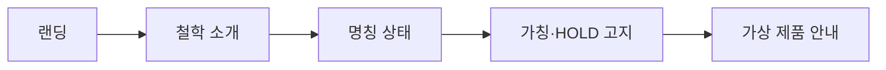

# VC-38 라온 사이트구조맵 A안 V3 — 가칭 고지형

## 1. Client·REQ 추적
- Client: VC-38 라온(가칭 브랜드 인지), REQ-038.
- 요구: `DAMORI(가칭)` 표기와 명칭·로고·상표 HOLD를 유지한다.
- 연결 제품: PROD-099 — 가상 제품 고지 카드.

## 2. 구조 전략
- 브랜드 철학과 명칭 확정 상태를 분리해 모든 화면에 가칭·미확정 배지를 노출한다.
- DAMORI 의미·상표·슬로건을 사실처럼 서술하지 않는다.

## 3. 페이지·콘텐츠·기능 계약
- PAGE-001 랜딩, PAGE-020 브랜드 소개, 전 스토리보드 공통 고지.
- 가칭 안내, 확정/미확정 범위, 원문 보기, 문의·복귀를 제공한다.

## 4. 사용자 흐름·상태
- 랜딩 → 철학 소개 → 명칭 상태 확인 → 가상 제품 고지.
- 상태: 가칭, 철학 확인, 명칭 HOLD, 상표 미확인, 오류·복귀.

## 5. 중복·끊김·가정 검증
- 가상 제품 고지 카드는 제품 실재·판매를 보증하지 않는다.
- 로고·슬로건·상표 정보는 확정 전 비워 둔다.

## 6. Mermaid

## 7. 판정
- KEEP / FACT_DISCLOSURE: 철학과 명칭 확정 상태를 분리해 공개한다.

