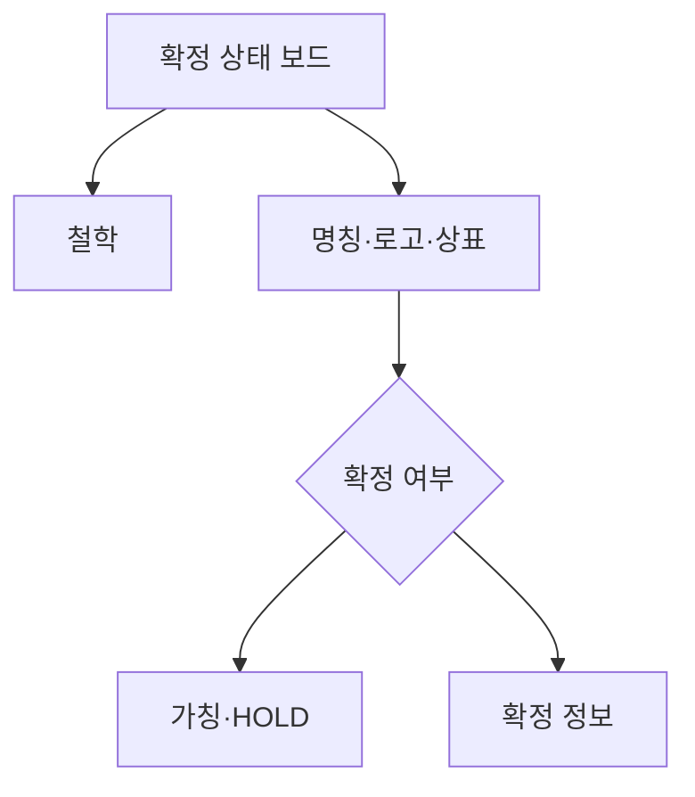

# VC-38 라온 사이트구조맵 B안 V3 — 확정 상태 보드형

## 1. Client·REQ 추적
- Client: VC-38 라온, REQ-038.
- 수용 조건: 브랜드 철학과 명칭 확정 상태를 분리해 이해한다.
- 연결 제품: PROD-099 — 가상 제품 고지 카드.

## 2. 구조 전략
- 브랜드 주장·명칭·로고·상표·슬로건을 상태 보드로 나누어 표시한다.
- 확인되지 않은 의미와 판매 정보는 HOLD로 둔다.

## 3. 페이지·콘텐츠·기능 계약
- PAGE-001 상태 요약, PAGE-020 철학·명칭 보드, 스토리보드 공통 고지.
- 상태별 출처, 미확정 이유, 복귀 경로를 제공한다.

## 4. 사용자 흐름·상태
- 상태 보드 → 항목 선택 → 근거 확인 → 가칭 유지/보류.
- 상태: 확인됨, 가칭, HOLD, 미확인, 오류·복귀.

## 5. 중복·끊김·가정 검증
- 제품 고지와 브랜드 설명은 별도 영역으로 두어 광고 오인을 막는다.
- DAMORI 의미를 임의로 번역하거나 확정하지 않는다.

## 6. Mermaid

## 7. 판정
- KEEP / FACT_DISCLOSURE: 상태별 근거와 미확정 범위를 병렬로 제공한다.

