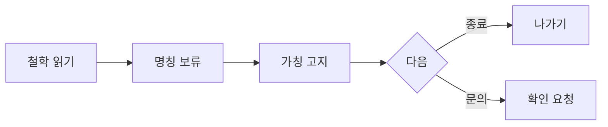

# VC-38 라온 사이트구조맵 C안 V3 — 보류 우선 브랜드형

## 1. Client·REQ 추적
- Client: VC-38 라온, REQ-038.
- 실패 조건: DAMORI 의미·상표·슬로건을 사실로 서술한다.
- 연결 제품: PROD-099 — 가상 제품 고지 카드.

## 2. 구조 전략
- 미확정 명칭과 제품은 보류 화면으로 격리하고 철학 콘텐츠만 확정 영역으로 제공한다.
- 사용자가 확인 가능한 출처가 있을 때만 상태를 갱신한다.

## 3. 페이지·콘텐츠·기능 계약
- PAGE-001 철학 진입, PAGE-020 브랜드 상태, 공통 보류 안내.
- 가칭 표시, 원문 보기, 문의, 취소·복귀를 제공한다.

## 4. 사용자 흐름·상태
- 철학 읽기 → 명칭 보류 → 고지 확인 → 종료 또는 문의.
- 상태: 철학 유효, 명칭 보류, 상표 미확인, 가상 제품, 오류·HOLD.

## 5. 중복·끊김·가정 검증
- 가상 제품 카드는 확정 제품 목록과 섞지 않는다.
- 보류 후에도 철학과 출처 맥락을 잃지 않는다.

## 6. Mermaid

## 7. 판정
- KEEP / FACT_DISCLOSURE: 미확정 브랜드 요소를 보류하고 사실 고지를 우선한다.

