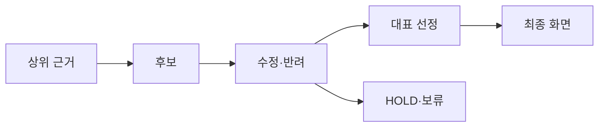

# VC-39 은호 사이트구조맵 A안 V3 — 결정 추적형 포트폴리오

## 1. Client·REQ 추적
- Client: VC-39 은호(포트폴리오 과정 검증), REQ-039.
- 요구: 과정 증거와 최종 결과를 연결하고 문서 수 자체를 성과로 제시하지 않는다.
- 연결 제품: PROD-029 — 대표 15개 선정 보드 / PROD-059 — 제품 생성·수정 과정 카드 / PROD-098 — 대표 제품 균형 점검표.

## 2. 구조 전략
- 상위 근거·결정·수정·반려·최종 화면을 하나의 추적선으로 연결한다.
- 반복 횟수·수량은 보조 정보이며 HOLD와 실패를 숨기지 않는다.

## 3. 페이지·콘텐츠·기능 계약
- 과정 페이지, 대표 결과, 주석·근거 보기, 비교·보류를 제공한다.
- 각 결정에 출처·상태·다음 행동·복귀 경로를 표시한다.

## 4. 사용자 흐름·상태
- 근거 → 후보 → 수정/반려 → 대표 선정 → 최종 화면.
- 상태: 제안, 검토, 수정, 반려, HOLD, 확정.

## 5. 중복·끊김·가정 검증
- 생성·수정 과정 카드는 결과를 대체하지 않고 결정 이유를 보완한다.
- 균형 점검표는 선정 편향 확인이며 품질 보장을 의미하지 않는다.

## 6. Mermaid

## 7. 판정
- KEEP / PORTFOLIO_HYPOTHESIS: 하나의 결정이 근거에서 화면까지 재현되도록 한다.

