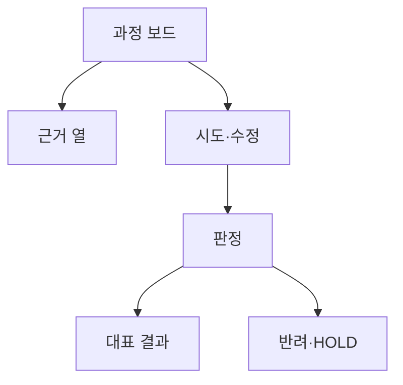

# VC-39 은호 사이트구조맵 B안 V3 — 과정 보드형

## 1. Client·REQ 추적
- Client: VC-39 은호, REQ-039.
- 수용 조건: 하나의 결정이 상위 근거에서 하위 화면까지 재현된다.
- 연결 제품: PROD-029 — 대표 15개 선정 보드 / PROD-059 — 제품 생성·수정 과정 카드 / PROD-098 — 대표 제품 균형 점검표.

## 2. 구조 전략
- 보드의 열을 근거·시도·판정·결과로 나누고 반려·HOLD도 동일하게 기록한다.
- 수량 대신 변화와 결정 이유를 중심으로 보여준다.

## 3. 페이지·콘텐츠·기능 계약
- 선정 보드, 과정 카드, 대표 결과, 근거 주석을 연결한다.
- 버전 비교, 출처 열기, 보류·복귀를 제공한다.

## 4. 사용자 흐름·상태
- 과정 보드 → 항목 선택 → 근거·수정 확인 → 대표 결과.
- 상태: 탐색, 채택, 수정, 반려, 보류, 확정.

## 5. 중복·끊김·가정 검증
- 대표 보드는 결과의 범위를 정하고 균형 점검표는 편향을 확인한다.
- 반려된 후보도 이유와 함께 보존한다.

## 6. Mermaid

## 7. 판정
- KEEP / PORTFOLIO_HYPOTHESIS: 과정의 증거성과 결과 재현성을 함께 확보한다.

