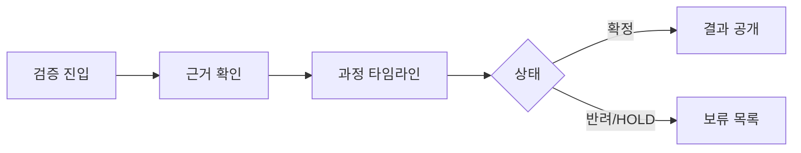

# VC-39 은호 사이트구조맵 C안 V3 — 검증 우선 공개형

## 1. Client·REQ 추적
- Client: VC-39 은호, REQ-039.
- 실패 조건: 반복 횟수·수량만 보여주거나 반려·HOLD를 숨긴다.
- 연결 제품: PROD-029 — 대표 15개 선정 보드 / PROD-059 — 제품 생성·수정 과정 카드 / PROD-098 — 대표 제품 균형 점검표.

## 2. 구조 전략
- 최종 결과보다 먼저 검증 상태와 근거를 공개하고 미확정 결과는 HOLD로 둔다.
- 대표 선정 이유를 한 단계씩 재현 가능하게 한다.

## 3. 페이지·콘텐츠·기능 계약
- 근거 요약, 과정 타임라인, 결과 화면, 반려·보류 목록을 제공한다.
- 출처 보기, 재검토, 취소·복귀를 제공한다.

## 4. 사용자 흐름·상태
- 검증 진입 → 근거 확인 → 과정 타임라인 → 결과/보류.
- 상태: 근거 확인, 검토 중, 반려, HOLD, 확정, 오류.

## 5. 중복·끊김·가정 검증
- 과정 카드가 성과 수치로 오인되지 않도록 결정 이유를 우선 노출한다.
- 보류·반려 이력은 결과에서 삭제하지 않는다.

## 6. Mermaid

## 7. 판정
- KEEP / PORTFOLIO_HYPOTHESIS: 과정 검증을 공개하고 결과를 과장하지 않는다.

