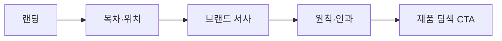

# VC-40 세아 사이트구조맵 A안 V3 — 목차형 긴 랜딩

## 1. Client·REQ 추적
- Client: VC-40 세아(긴 랜딩 서사 탐색), REQ-040.
- 요구: 끝까지 읽지 않아도 브랜드와 제품 탐색 위치를 이해한다.
- 연결 제품: 직접 연결 제품 없음(구조 후보만 검증).

## 2. 구조 전략
- 상단 목차·현재 위치·섹션 요약으로 긴 서사를 탐색 가능하게 한다.
- 브랜드 → 원칙 → 제품 탐색의 인과를 유지하고 반복 섹션을 제거한다.

## 3. 페이지·콘텐츠·기능 계약
- PAGE-001 랜딩, PAGE-020 브랜드 서사, PAGE-021 제품 탐색 진입.
- 목차 앵커, 섹션 요약, 최종 CTA, 위로/복귀를 제공한다.

## 4. 사용자 흐름·상태
- 랜딩 진입 → 목차 선택 → 브랜드 서사 → 제품 탐색 CTA.
- 상태: 상단, 중간 섹션, 제품 탐색 대기, CTA 완료, 오류·복귀.

## 5. 중복·끊김·가정 검증
- 랜딩은 쇼핑몰 목록이나 회사소개서 장문으로만 구성하지 않는다.
- 섹션 요약만 읽어도 다음 위치와 목적을 알 수 있어야 한다.

## 6. Mermaid

## 7. 판정
- CANDIDATE / HYPOTHESIS: 긴 서사를 위치 단서와 CTA로 검증한다.

