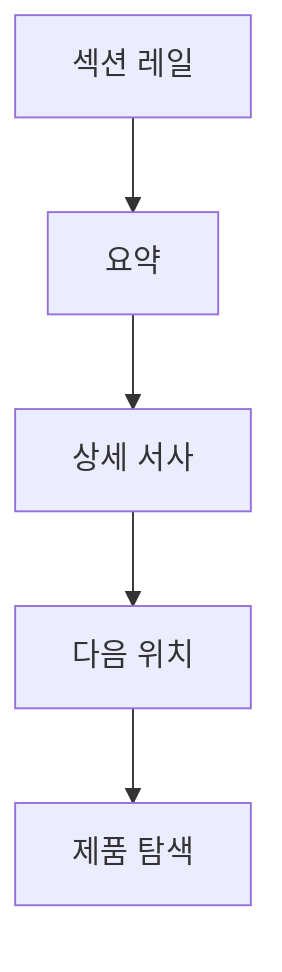

# VC-40 세아 사이트구조맵 B안 V3 — 요약 레일형

## 1. Client·REQ 추적
- Client: VC-40 세아, REQ-040.
- 수용 조건: 전체를 끝까지 읽지 않아도 브랜드와 제품 탐색 위치를 설명한다.
- 연결 제품: 직접 연결 제품 없음(구조 후보만 검증).

## 2. 구조 전략
- 화면 측면에 섹션 레일·진행 상태·요약을 고정한다.
- 브랜드 서사와 제품 탐색을 분리된 단계로 연결한다.

## 3. 페이지·콘텐츠·기능 계약
- PAGE-001 레일 랜딩, PAGE-020 서사, PAGE-021 탐색 진입.
- 현재 섹션, 다음 섹션, 최종 CTA, 복귀를 제공한다.

## 4. 사용자 흐름·상태
- 레일 선택 → 서사 요약 → 상세 읽기 → 제품 탐색.
- 상태: 선택 섹션, 읽는 중, 건너뜀, 탐색 진입, 오류·복귀.

## 5. 중복·끊김·가정 검증
- 레일 요약은 본문 반복이 아니라 위치·목적 안내다.
- CTA는 한 번 명확히 노출하고 쇼핑몰형 목록을 만들지 않는다.

## 6. Mermaid

## 7. 판정
- CANDIDATE / HYPOTHESIS: 긴 랜딩의 방향 감각과 인과를 검증한다.

