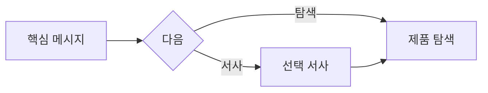

# VC-40 세아 사이트구조맵 C안 V3 — CTA 우선 안전형

## 1. Client·REQ 추적
- Client: VC-40 세아, REQ-040.
- 실패 조건: 쇼핑몰형 상품 목록이나 회사소개서형 장문만 남는다.
- 연결 제품: 직접 연결 제품 없음(구조 후보만 검증).

## 2. 구조 전략
- 첫 화면에서 브랜드 정체성과 최종 탐색 CTA를 제시하고 서사는 선택적으로 읽는다.
- 반복·장문을 접어 핵심 경로를 짧게 유지한다.

## 3. 페이지·콘텐츠·기능 계약
- PAGE-001 핵심 랜딩, PAGE-020 선택 서사, PAGE-021 제품 탐색.
- CTA, 섹션 펼치기, 목차, 복귀·취소를 제공한다.

## 4. 사용자 흐름·상태
- 핵심 메시지 → CTA 또는 서사 펼치기 → 제품 탐색.
- 상태: 핵심 확인, 서사 선택, 탐색, 보류, 오류·HOLD.

## 5. 중복·끊김·가정 검증
- CTA가 구매를 강제하지 않고 탐색 진입임을 명시한다.
- 서사를 접어도 브랜드·제품 관계를 이해할 수 있어야 한다.

## 6. Mermaid

## 7. 판정
- CANDIDATE / HYPOTHESIS: 명확한 CTA와 선택적 서사로 탐색 성공 여부를 확인한다.

