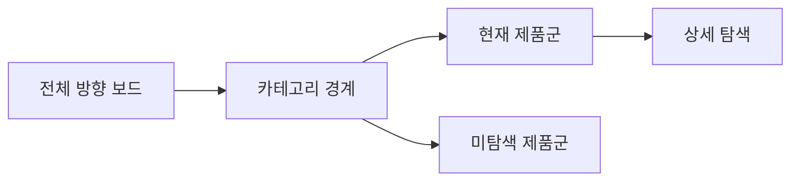

# VC-41 유나 사이트구조맵 A안 V3 — 전체 방향 보드형

## 1. Client·REQ 추적
- Client: VC-41 유나(200개 후보군 전체 방향 감각), REQ-041.
- 요구: 현재 보는 제품군과 아직 보지 않은 제품군을 구분한다.
- 연결 제품: PROD-030 — 카테고리 경계 안내 카드 / PROD-060 — 다중 카테고리 이동 카드 / PROD-100 — 전체 후보군 방향 보드.

## 2. 구조 전략
- 전체 후보군 방향 보드, 카테고리 경계, 현재 범위를 고정 노출한다.
- 200개를 한 레일에 나열하거나 검색만으로 탐색을 대체하지 않는다.

## 3. 페이지·콘텐츠·기능 계약
- PAGE-021 후보군 보드, 대표 제품 Section, Breadcrumb·Heading.
- 현재 범위, 미탐색 범위, 카테고리 전환, 중복 소속 설명을 제공한다.

## 4. 사용자 흐름·상태
- 전체 보드 → 카테고리 선택 → 제품군 범위 확인 → 상세 탐색.
- 상태: 전체 개요, 현재 군, 미탐색, 중복 소속, 오류·복귀.

## 5. 중복·끊김·가정 검증
- 다중 카테고리 카드는 이동 경로를 설명하며 중복 제품을 숨기지 않는다.
- 방향 보드는 목록 대체가 아니라 범위 인식을 돕는다.

## 6. Mermaid

## 7. 판정
- CANDIDATE / HYPOTHESIS: 대량 후보의 범위와 미탐색 영역을 검증한다.

