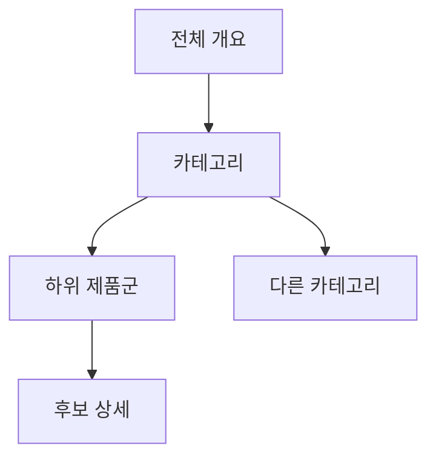

# VC-41 유나 사이트구조맵 B안 V3 — 계층 탐색형

## 1. Client·REQ 추적
- Client: VC-41 유나, REQ-041.
- 수용 조건: 현재 보고 있는 제품군과 아직 보지 않은 제품군을 구분한다.
- 연결 제품: PROD-030 — 카테고리 경계 안내 카드 / PROD-060 — 다중 카테고리 이동 카드 / PROD-100 — 전체 후보군 방향 보드.

## 2. 구조 전략
- 전체 → 카테고리 → 하위 제품군 → 후보의 계층과 Breadcrumb을 유지한다.
- 카테고리 전환 때 현재·미탐색 범위를 갱신한다.

## 3. 페이지·콘텐츠·기능 계약
- PAGE-021 계층 목록, 대표 Section, Breadcrumb·Heading.
- 범위 요약, 이전/다음 카테고리, 중복 소속, 복귀를 제공한다.

## 4. 사용자 흐름·상태
- 전체 개요 → 카테고리 → 하위군 → 후보 상세.
- 상태: 현재 위치, 미탐색, 탐색 완료, 중복, 보류·복귀.

## 5. 중복·끊김·가정 검증
- 중복 소속은 각 경로에 표시하고 하나의 카테고리로 임의 병합하지 않는다.
- 검색은 보조 수단이며 계층 방향을 대체하지 않는다.

## 6. Mermaid

## 7. 판정
- CANDIDATE / HYPOTHESIS: 계층과 Breadcrumb으로 전체 방향 감각을 제공한다.

