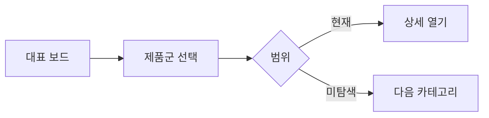

# VC-41 유나 사이트구조맵 C안 V3 — 대표·미탐색 분리형

## 1. Client·REQ 추적
- Client: VC-41 유나, REQ-041.
- 실패 조건: 전체 200개를 한 레일에 나열하거나 검색만으로 탐색을 대체한다.
- 연결 제품: PROD-030 — 카테고리 경계 안내 카드 / PROD-060 — 다중 카테고리 이동 카드 / PROD-100 — 전체 후보군 방향 보드.

## 2. 구조 전략
- 대표 제품군과 미탐색 제품군을 분리해 먼저 방향을 제시한다.
- 상세 목록은 선택 시에만 열고 현재 범위를 유지한다.

## 3. 페이지·콘텐츠·기능 계약
- PAGE-021 대표/미탐색 보드, 카테고리 전환, Breadcrumb.
- 미탐색 수, 현재 위치, 중복 소속, 보류·복귀를 제공한다.

## 4. 사용자 흐름·상태
- 대표 보드 → 제품군 선택 → 미탐색 확인 → 상세 열기.
- 상태: 대표, 미탐색, 현재 군, 열람 중, 보류, 오류·HOLD.

## 5. 중복·끊김·가정 검증
- 대표 보드는 전체 후보의 축약이며 품질 순위를 의미하지 않는다.
- 미탐색 범위를 숨기지 않고 카테고리별로 표시한다.

## 6. Mermaid

## 7. 판정
- CANDIDATE / HYPOTHESIS: 대표와 미탐색을 분리해 전체 방향을 보존한다.

