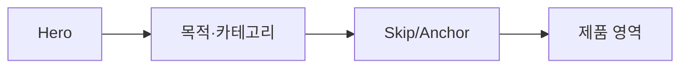

# VC-42 현서 사이트구조맵 A안 V3 — Hero·탐색 동시 노출형

## 1. Client·REQ 추적
- Client: VC-42 현서(시각적 Hero와 탐색 균형), REQ-042.
- 요구: 첫 화면에서 카테고리 목적과 다음 행동을 이해한다.
- 연결 제품: 직접 연결 제품 없음(구조 후보만 검증).

## 2. 구조 전략
- Hero 안에 목적·카테고리·다음 행동을 함께 노출하고 장식 이미지는 정보 분류를 대신하지 않는다.
- Skip·Anchor로 제품 영역에 즉시 접근한다.

## 3. 페이지·콘텐츠·기능 계약
- PAGE-021 Hero·카테고리 진입.
- 목적 문장, 카테고리 링크, Skip, Anchor, 오류·복귀를 제공한다.

## 4. 사용자 흐름·상태
- Hero → 목적 확인 → 카테고리 선택 → 제품 영역.
- 상태: Hero, 탐색 가능, Skip 사용, 카테고리 선택, 오류·복귀.

## 5. 중복·끊김·가정 검증
- 장식 이미지는 분위기를 보조하며 카테고리 분류를 담당하지 않는다.
- 제품 영역 진입은 장식 스크롤을 요구하지 않는다.

## 6. Mermaid

## 7. 판정
- CANDIDATE / HYPOTHESIS: 시각성과 탐색 정보의 동시 이해를 검증한다.

