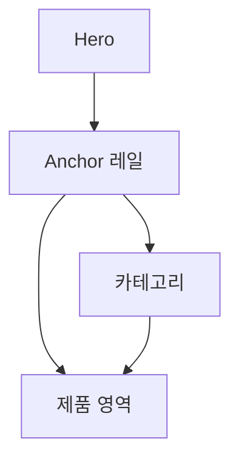

# VC-42 현서 사이트구조맵 B안 V3 — Anchor 레일형

## 1. Client·REQ 추적
- Client: VC-42 현서, REQ-042.
- 수용 조건: 첫 화면에서 카테고리 목적과 다음 행동을 이해한다.
- 연결 제품: 직접 연결 제품 없음(구조 후보만 검증).

## 2. 구조 전략
- Hero 옆 고정 Anchor 레일에 카테고리·제품 영역을 배치한다.
- 이미지와 분류 정보를 분리하고 현재 위치를 표시한다.

## 3. 페이지·콘텐츠·기능 계약
- PAGE-021 Hero·카테고리·제품 진입.
- Anchor 레일, 현재 Heading, Skip, 복귀를 제공한다.

## 4. 사용자 흐름·상태
- Hero → Anchor 선택 → 카테고리 → 제품 영역.
- 상태: 상단, 카테고리, 제품, 이동 중, 오류·복귀.

## 5. 중복·끊김·가정 검증
- Anchor는 위치 안내이며 이미지 설명을 대체하지 않는다.
- 장식 영역을 지나지 않고 제품 영역에 도달할 수 있다.

## 6. Mermaid

## 7. 판정
- CANDIDATE / HYPOTHESIS: 시각적 Hero와 빠른 탐색의 균형을 검증한다.

