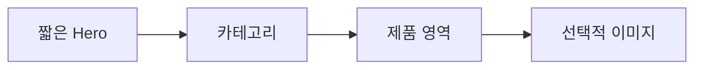

# VC-42 현서 사이트구조맵 C안 V3 — 탐색 우선 Hero형

## 1. Client·REQ 추적
- Client: VC-42 현서, REQ-042.
- 실패 조건: 제품 영역을 찾기 위해 긴 장식을 지나거나 이미지가 분류를 대신한다.
- 연결 제품: 직접 연결 제품 없음(구조 후보만 검증).

## 2. 구조 전략
- Hero는 짧게 유지하고 카테고리·제품 탐색을 첫 화면에서 우선 제공한다.
- 장식 이미지는 선택 콘텐츠로 접고 Skip·Anchor를 고정한다.

## 3. 페이지·콘텐츠·기능 계약
- PAGE-021 첫 화면, 카테고리, 제품 진입.
- 목적·다음 행동, 접기, Skip, Anchor, 복귀를 제공한다.

## 4. 사용자 흐름·상태
- 짧은 Hero → 카테고리 선택 → 제품 영역 → 선택적 이미지.
- 상태: 목적 확인, 탐색, 이미지 접힘, 제품 진입, 오류·HOLD.

## 5. 중복·끊김·가정 검증
- 이미지가 카테고리를 암시하지 않으며 텍스트 정보가 기준이다.
- 긴 장식으로 탐색이 지연되지 않는다.

## 6. Mermaid

## 7. 판정
- CANDIDATE / HYPOTHESIS: 시각 장식과 탐색 우선순위의 균형을 검증한다.

