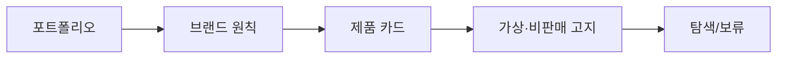

# VC-43 다빈 사이트구조맵 A안 V3 — 비판매 고지형

## 1. Client·REQ 추적
- Client: VC-43 다빈(비판매 포트폴리오 인지), REQ-043.
- 요구: UI·전략 검증용 가상 제품임을 고지하고 구매 기능을 차단한다.
- 연결 제품: PROD-099 — 가상 제품 고지 카드.

## 2. 구조 전략
- 모든 제품 카드 상단에 비판매·검증용 배지를 두고 브랜드 원칙과 연결한다.
- 판매·배송·재고·후기를 암시하는 요소는 제거한다.

## 3. 페이지·콘텐츠·기능 계약
- PAGE-001 포트폴리오 랜딩, PAGE-020 브랜드 원칙, PAGE-021 제품 카드.
- 가상 제품 고지, 원칙 연결, 비교·보류, 문의·복귀를 제공한다.

## 4. 사용자 흐름·상태
- 랜딩 → 원칙 확인 → 제품 카드 → 가상 고지 확인 → 탐색/보류.
- 상태: 검증용, 비판매, 비교, 보류, 오류·복귀.

## 5. 중복·끊김·가정 검증
- 가상 제품 고지 카드는 구매·재고 정보를 제공하지 않는다.
- 제품 후보와 브랜드 원칙 관계만 검증한다.

## 6. Mermaid

## 7. 판정
- CANDIDATE / HYPOTHESIS: 비판매 포트폴리오 인지 여부를 고지로 검증한다.

