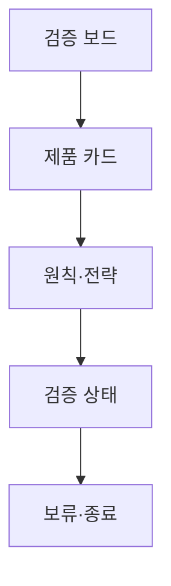

# VC-43 다빈 사이트구조맵 B안 V3 — 검증 결과 보드형

## 1. Client·REQ 추적
- Client: VC-43 다빈, REQ-043.
- 수용 조건: 제품을 구매 대상이 아니라 설계·분류 검증 결과로 이해한다.
- 연결 제품: PROD-099 — 가상 제품 고지 카드.

## 2. 구조 전략
- 제품별 목적·원칙·검증 상태를 보드로 보여주며 구매 CTA를 두지 않는다.
- 실제 판매 정보가 아니라 설계 판단 근거만 노출한다.

## 3. 페이지·콘텐츠·기능 계약
- PAGE-020 원칙 보드, PAGE-021 제품 검증 결과, PAGE-001 진입.
- 가상 배지, 근거·상태, 비교·보류, 복귀를 제공한다.

## 4. 사용자 흐름·상태
- 검증 보드 → 카드 선택 → 원칙·전략 확인 → 보류/종료.
- 상태: 후보, 검증 중, 검증 완료, 보류, 비판매, 오류.

## 5. 중복·끊김·가정 검증
- 결과 보드는 상품 목록이나 구매 순위가 아니다.
- 후기·재고·배송 정보는 존재하지 않음을 명시한다.

## 6. Mermaid

## 7. 판정
- CANDIDATE / HYPOTHESIS: 검증 결과와 판매 목적을 분리해 이해시키는 구조다.

