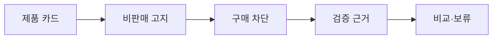

# VC-43 다빈 사이트구조맵 C안 V3 — 구매 차단 안전형

## 1. Client·REQ 추적
- Client: VC-43 다빈, REQ-043.
- 실패 조건: 실제 판매·배송·재고·후기를 암시한다.
- 연결 제품: PROD-099 — 가상 제품 고지 카드.

## 2. 구조 전략
- 가상 제품임을 먼저 알리고 구매 관련 동작은 비활성화한다.
- 포트폴리오 과정·분류 검증만 탐색하도록 한다.

## 3. 페이지·콘텐츠·기능 계약
- PAGE-001 고지 진입, PAGE-020 원칙, PAGE-021 카드·비교.
- 구매 차단, 검증 근거, 원문 보기, 취소·복귀를 제공한다.

## 4. 사용자 흐름·상태
- 제품 카드 → 비판매 고지 → 검증 근거 → 비교/보류.
- 상태: 구매 차단, 검증, 보류, 종료, 오류·HOLD.

## 5. 중복·끊김·가정 검증
- 가상 고지와 구매 차단 상태를 모든 제품 카드에 반복 노출한다.
- 후기·재고·배송을 제공하지 않으며 포트폴리오 맥락을 보존한다.

## 6. Mermaid

## 7. 판정
- CANDIDATE / HYPOTHESIS: 구매 오인을 차단한 상태에서 포트폴리오를 탐색한다.

