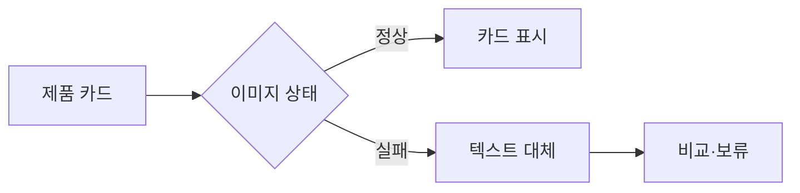

# VC-44 로운 사이트구조맵 A안 V3 — 텍스트 우선 오류 대응형

## 1. Client·REQ 추적
- Client: VC-44 로운(이미지 실패 상황의 제품 판단), REQ-044.
- 요구: 이미지 없이도 제품명·분류·차이를 이해하고 비교를 계속한다.
- 연결 제품: PROD-019 — 텍스트 우선 제품 카드 세트 / PROD-020 — 저연결성 기록 카드 / PROD-050 — 이미지 실패 비교표 / PROD-086 — 카드 오류 대체 템플릿.

## 2. 구조 전략
- 이미지와 독립된 텍스트 카드·분류·차이를 우선 제공한다.
- 이미지 오류·오프라인에서도 카드와 CTA 레이아웃을 유지한다.

## 3. 페이지·콘텐츠·기능 계약
- PAGE-001 진입, PAGE-021 제품 카드·비교.
- 오류 대체 텍스트, 비교 기준, 재시도·보류·복귀를 제공한다.

## 4. 사용자 흐름·상태
- 제품 카드 → 이미지 실패 감지 → 텍스트 대체 → 두 후보 비교.
- 상태: 정상, 이미지 실패, 오프라인, 비교, 보류, 오류.

## 5. 중복·끊김·가정 검증
- 오류 템플릿은 파일명만 노출하지 않고 제품 의미를 유지한다.
- 저연결성 카드도 CTA와 분류 정보를 잃지 않는다.

## 6. Mermaid

## 7. 판정
- CANDIDATE / HYPOTHESIS: 이미지 실패 뒤에도 제품 판단이 가능한지 검증한다.

