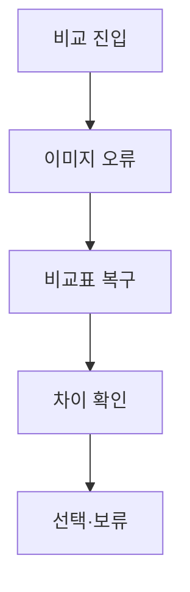

# VC-44 로운 사이트구조맵 B안 V3 — 비교표 복구형

## 1. Client·REQ 추적
- Client: VC-44 로운, REQ-044.
- 수용 조건: 이미지 없이 두 후보의 차이를 설명하고 비교를 계속한다.
- 연결 제품: PROD-019 — 텍스트 우선 제품 카드 세트 / PROD-020 — 저연결성 기록 카드 / PROD-050 — 이미지 실패 비교표 / PROD-086 — 카드 오류 대체 템플릿.

## 2. 구조 전략
- 이미지 실패 시 비교표를 기본 화면으로 전환하고 이름·분류·차이·상태를 고정한다.
- 파일명만 읽게 하지 않고 오류 원인과 재시도를 제공한다.

## 3. 페이지·콘텐츠·기능 계약
- PAGE-021 비교표·오류 상태, PAGE-001 복귀.
- 비교 열, 상태 배지, 재시도, 보류·취소를 제공한다.

## 4. 사용자 흐름·상태
- 비교 진입 → 이미지 오류 → 비교표 복구 → 선택/보류.
- 상태: 비교 중, 이미지 실패, 대체표, 오프라인, 선택, 복귀.

## 5. 중복·끊김·가정 검증
- 이미지 실패 비교표는 카드 대체 수단이며 제품 정보 출처를 표시한다.
- 레이아웃 붕괴 없이 CTA 위치를 유지한다.

## 6. Mermaid

## 7. 판정
- CANDIDATE / HYPOTHESIS: 오류 상태에서도 비교 과업이 지속되는지 확인한다.

