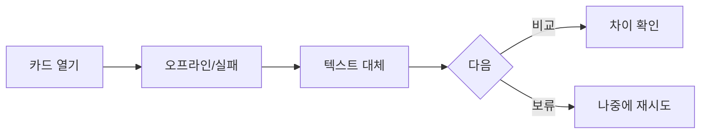

# VC-44 로운 사이트구조맵 C안 V3 — 오프라인 보류 안전형

## 1. Client·REQ 추적
- Client: VC-44 로운, REQ-044.
- 실패 조건: 파일명만 읽거나 카드·CTA가 사라진다.
- 연결 제품: PROD-019 — 텍스트 우선 제품 카드 세트 / PROD-020 — 저연결성 기록 카드 / PROD-050 — 이미지 실패 비교표 / PROD-086 — 카드 오류 대체 템플릿.

## 2. 구조 전략
- 오프라인·이미지 실패에서는 텍스트 정보와 보류를 우선하고 구매·선택을 강제하지 않는다.
- 복구 후 재시도해도 카드 구조와 CTA를 유지한다.

## 3. 페이지·콘텐츠·기능 계약
- PAGE-001 상태 안내, PAGE-021 카드·비교·보류.
- 파일명 대신 제품명·분류·차이·재시도·복귀를 제공한다.

## 4. 사용자 흐름·상태
- 카드 열기 → 오프라인/실패 → 텍스트 대체 → 보류 또는 비교.
- 상태: 오프라인, 대체, 보류, 재시도, 비교, 오류·HOLD.

## 5. 중복·끊김·가정 검증
- 오류 대체 템플릿은 실제 이미지가 복구됐다고 암시하지 않는다.
- 보류 후에도 비교 기준과 원래 위치를 보존한다.

## 6. Mermaid

## 7. 판정
- CANDIDATE / HYPOTHESIS: 오프라인에서도 제품 의미와 탐색 경로를 보존한다.

