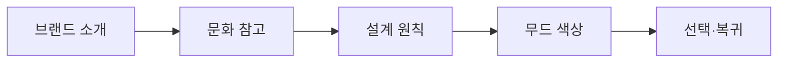

# VC-45 해나 사이트구조맵 A안 V3 — 원칙 연결형

## 1. Client·REQ 추적
- Client: VC-45 해나(한국적 정서의 진정성), REQ-045.
- 요구: 문화 요소를 절제하고 기능·재료와 연결하며 가칭 브랜드 의미와 분리한다.
- 연결 제품: PROD-081 — 무드 색상 선택표.

## 2. 구조 전략
- 색·재료·여백의 설계 원칙과 문화적 참고를 함께 설명하되 전통성을 임의 확정하지 않는다.
- 장식 반복 대신 기능적 이유를 먼저 노출한다.

## 3. 페이지·콘텐츠·기능 계약
- PAGE-001 랜딩, PAGE-020 브랜드 소개, 스타일 가이드.
- 원칙 근거, 무드 선택, 미확정 고지, 원문 보기·복귀를 제공한다.

## 4. 사용자 흐름·상태
- 브랜드 소개 → 문화 참고 → 설계 원칙 → 무드 색상 선택.
- 상태: 원칙 확인, 참고, 미확정, 선택, 오류·복귀.

## 5. 중복·끊김·가정 검증
- 무드 색상표는 선택 도구이며 한국적 정서를 대표한다고 단정하지 않는다.
- DAMORI 이름 의미와 문화 요소를 별도 상태로 유지한다.

## 6. Mermaid

## 7. 판정
- CANDIDATE / HYPOTHESIS: 문화 요소가 설계 원칙으로 설명되는지 검증한다.

