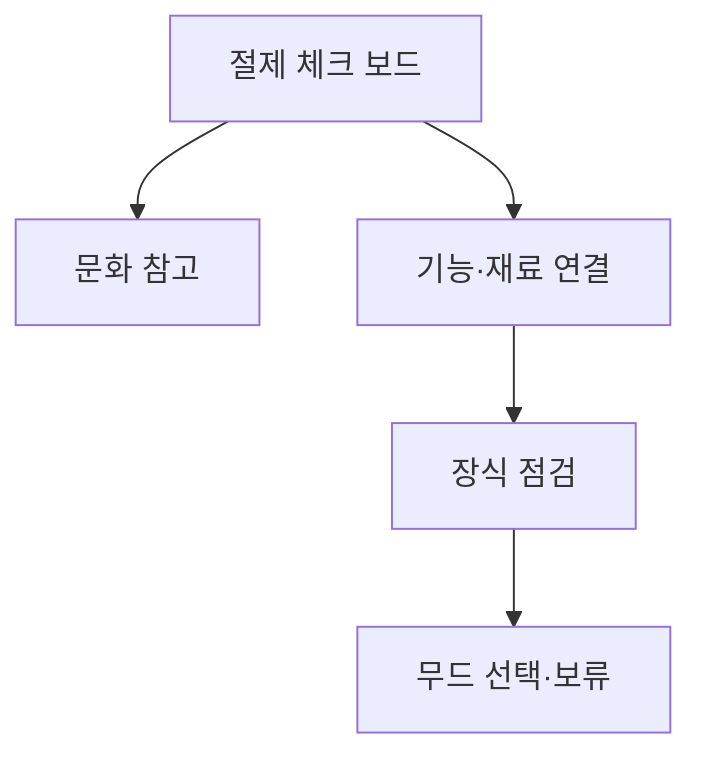

# VC-45 해나 사이트구조맵 B안 V3 — 절제 체크 보드형

## 1. Client·REQ 추적
- Client: VC-45 해나, REQ-045.
- 수용 조건: 한국적 정서가 어떤 설계 원칙에 연결됐는지 설명한다.
- 연결 제품: PROD-081 — 무드 색상 선택표.

## 2. 구조 전략
- 문화 참고, 기능 연결, 장식 사용 여부, 미확정을 체크 보드로 비교한다.
- 장식적 과잉과 근거 없는 전통성 문구를 차단한다.

## 3. 페이지·콘텐츠·기능 계약
- PAGE-020 원칙 보드, PAGE-001 진입, 스타일 가이드.
- 체크 근거, 색상 선택, 보류·복귀를 제공한다.

## 4. 사용자 흐름·상태
- 체크 보드 → 근거 열람 → 원칙 확인 → 무드 선택/보류.
- 상태: 확인, 부분 확인, 미확정, 보류, 선택, 오류.

## 5. 중복·끊김·가정 검증
- 체크 보드는 판단 보조이지 문화 인증이나 전통성 증명이 아니다.
- 색상 선택표와 브랜드 의미는 별도 콘텐츠로 유지한다.

## 6. Mermaid

## 7. 판정
- CANDIDATE / HYPOTHESIS: 문화 요소와 기능의 연결성을 체크 단위로 검증한다.

