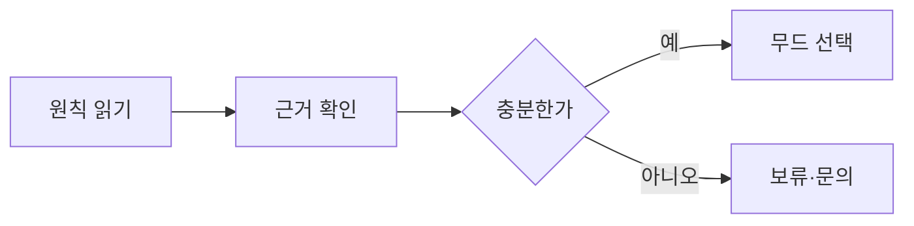

# VC-45 해나 사이트구조맵 C안 V3 — 근거 부족 보류형

## 1. Client·REQ 추적
- Client: VC-45 해나, REQ-045.
- 실패 조건: DAMORI 이름 의미나 전통성을 임의 확정하고 장식을 반복한다.
- 연결 제품: PROD-081 — 무드 색상 선택표.

## 2. 구조 전략
- 근거가 부족한 문화 해석은 보류하고 확인된 설계 원칙만 공개한다.
- 무드는 선택 가능하되 문화 대표성 문구를 붙이지 않는다.

## 3. 페이지·콘텐츠·기능 계약
- PAGE-001 원칙 요약, PAGE-020 브랜드 소개, 스타일 가이드.
- 근거 상태, 미확정 고지, 색상 선택, 문의·복귀를 제공한다.

## 4. 사용자 흐름·상태
- 원칙 읽기 → 근거 확인 → 보류/무드 선택 → 복귀.
- 상태: 확인됨, 근거 부족, 보류, 선택, 오류·HOLD.

## 5. 중복·끊김·가정 검증
- 무드 색상은 미감 선택이며 문화적 진정성을 보장하지 않는다.
- 보류 후에도 근거와 다음 확인 행동을 보존한다.

## 6. Mermaid

## 7. 판정
- CANDIDATE / HYPOTHESIS: 불확실한 문화 해석을 보류하고 근거 중심으로 탐색한다.

