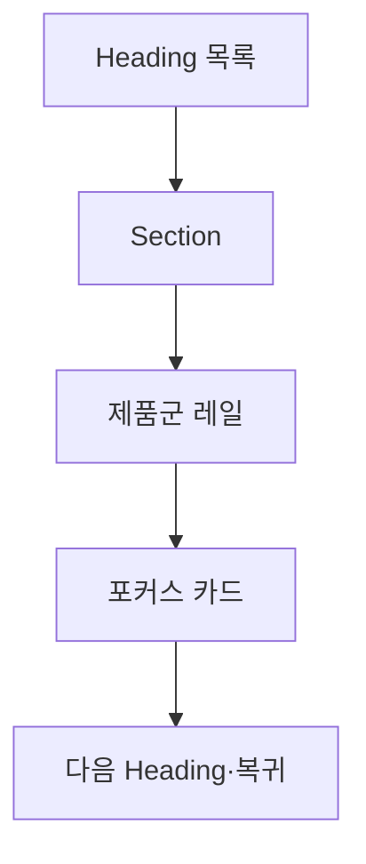

# VC-46 지율 사이트구조맵 B안 V3 — Heading 레일 보드형

## 1. Client·REQ 추적
- Client: VC-46 지율, REQ-046.
- 수용 조건: 모든 제품을 듣지 않고 원하는 Section과 제품군으로 이동한다.
- 연결 제품: PROD-021 — 레일 탐색 보조 라벨 세트 / PROD-049 — Heading 탐색 제품 목록 / PROD-085 — 제품 Section 요약 카드 / PROD-087 — 포커스 순서 제품 카드.

## 2. 구조 전략
- Heading 목록과 레일 보조 라벨로 현재·전체 범위를 병렬 표시한다.
- 반복 콘텐츠는 요약 후 상세로 이동하며 탈출 경로를 제공한다.

## 3. 페이지·콘텐츠·기능 계약
- PAGE-001 Heading 목차, PAGE-020 요약, PAGE-021 제품 레일.
- Heading 이동, Skip, 포커스 순서, 카드 종료·복귀를 제공한다.

## 4. 사용자 흐름·상태
- Heading 목록 → Section → 제품군 → 포커스 카드 → 복귀.
- 상태: 목차, Section, 레일, 포커스, Skip, 오류.

## 5. 중복·끊김·가정 검증
- 대체 텍스트는 제품 의미를 한 번만 전달한다.
- 레일 끝에서 다음 Section이나 상위 Heading으로 이동 가능하다.

## 6. Mermaid

## 7. 판정
- MERGE / INFERENCE: Heading·레일·포커스 순서를 일관된 DOM 이동으로 설계한다.

