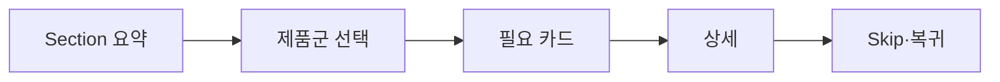

# VC-46 지율 사이트구조맵 C안 V3 — 요약 우선 탐색형

## 1. Client·REQ 추적
- Client: VC-46 지율, REQ-046.
- 실패 조건: 시각 순서와 DOM 순서가 다르거나 반복 카드가 탈출 불가능하다.
- 연결 제품: PROD-021 — 레일 탐색 보조 라벨 세트 / PROD-049 — Heading 탐색 제품 목록 / PROD-085 — 제품 Section 요약 카드 / PROD-087 — 포커스 순서 제품 카드.

## 2. 구조 전략
- Section 요약을 먼저 읽고 필요한 제품군만 열도록 해 반복 낭독을 줄인다.
- 모든 이동에 Skip·복귀·현재 위치를 고정한다.

## 3. 페이지·콘텐츠·기능 계약
- PAGE-001 요약, PAGE-020 Section, PAGE-021 선택 레일.
- 요약·상세 전환, Skip, 포커스 이동, 오류·복귀를 제공한다.

## 4. 사용자 흐름·상태
- Section 요약 → 제품군 선택 → 필요한 카드만 탐색 → 복귀.
- 상태: 요약, 선택 레일, 상세, Skip, 보류, 오류·HOLD.

## 5. 중복·끊김·가정 검증
- 요약 카드와 상세 카드는 역할을 분리하고 중복 대체 텍스트를 제거한다.
- 키보드·스크린리더가 카드 영역에서 빠져나올 수 있다.

## 6. Mermaid

## 7. 판정
- MERGE / INFERENCE: 요약과 선택 레일로 긴 페이지의 탐색 부담을 줄인다.

