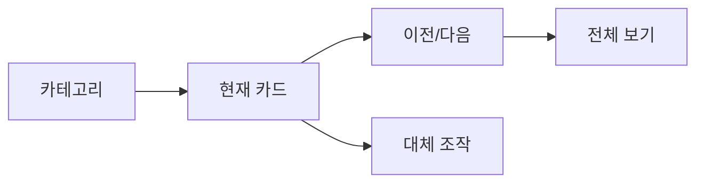

# VC-47 주하 사이트구조맵 A안 V3 — 모바일 레일 제어형

## 1. Client·REQ 추적
- Client: VC-47 주하(모바일 제품 레일 발견), REQ-047.
- 요구: 레일 안에서만 가로 이동하고 이전·다음·번호와 전체 보기 CTA를 제공한다.
- 연결 제품: PROD-021 — 레일 탐색 보조 라벨 세트 / PROD-051 — 키보드·터치 대체 조작 카드.

## 2. 구조 전략
- 본문은 세로 흐름을 유지하고 제품 레일만 가로 이동 가능하게 한다.
- 자동 캐러셀·무한 루프·제스처 전용 조작을 금지한다.

## 3. 페이지·콘텐츠·기능 계약
- PAGE-001 모바일 레일, PAGE-021 카테고리 서브 페이지.
- 이전·다음·번호, 전체 보기, 키보드·터치 대체, 현재 위치를 제공한다.

## 4. 사용자 흐름·상태
- 카테고리 진입 → 레일 현재 카드 → 다음/이전 → 전체 보기.
- 상태: 첫 카드, 중간, 마지막, 전체 보기, 오류·복귀.

## 5. 중복·끊김·가정 검증
- 보조 라벨은 위치와 범위를 알리고 콘텐츠를 중복 낭독하지 않는다.
- 대체 조작으로 스와이프 없이도 이동 가능하다.

## 6. Mermaid

## 7. 판정
- KEEP / HYPOTHESIS: 모바일 레일 탐색성과 전체 경로 이해를 함께 검증한다.

