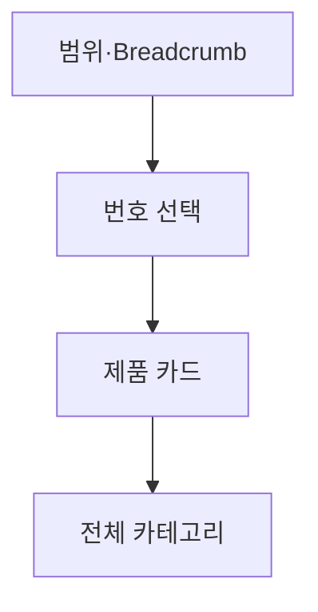

# VC-47 주하 사이트구조맵 B안 V3 — 번호·범위 보드형

## 1. Client·REQ 추적
- Client: VC-47 주하, REQ-047.
- 수용 조건: 다음 제품 존재와 전체 카테고리 경로를 이해한다.
- 연결 제품: PROD-021 — 레일 탐색 보조 라벨 세트 / PROD-051 — 키보드·터치 대체 조작 카드.

## 2. 구조 전략
- 레일 상단에 현재 번호/전체 수와 카테고리 Breadcrumb을 표시한다.
- 버튼·키보드·터치 모두 같은 이동 상태를 갱신한다.

## 3. 페이지·콘텐츠·기능 계약
- PAGE-001 레일 보드, PAGE-021 전체 카테고리.
- 번호, 범위, 이전·다음, 전체 보기, 복귀를 제공한다.

## 4. 사용자 흐름·상태
- 범위 확인 → 번호 선택 → 카드 열기 → 전체 카테고리 복귀.
- 상태: 현재 번호, 범위, 이동 중, 전체 목록, 오류·복귀.

## 5. 중복·끊김·가정 검증
- 번호는 순서를 알리며 중요도나 품질 순위를 의미하지 않는다.
- 본문 가로 스크롤 없이 레일 컨테이너에서만 이동한다.

## 6. Mermaid

## 7. 판정
- KEEP / HYPOTHESIS: 모바일에서도 제품 위치와 전체 경로를 명확히 한다.

