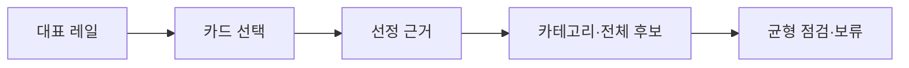

# VC-48 태린 사이트구조맵 A안 V3 — 대표 근거 추적형

## 1. Client·REQ 추적
- Client: VC-48 태린(대표 15개 선정 이유 확인), REQ-048.
- 요구: 각 대표가 어떤 요구·카테고리를 대표하는지 설명한다.
- 연결 제품: PROD-029 — 대표 15개 선정 보드 / PROD-059 — 제품 생성·수정 과정 카드 / PROD-098 — 대표 제품 균형 점검표.

## 2. 구조 전략
- 대표 카드에 요구·카테고리·선정 근거·전체 후보 연결을 함께 제공한다.
- 인기·베스트·디자인 취향만으로 선정하지 않고 편중을 검사한다.

## 3. 페이지·콘텐츠·기능 계약
- PAGE-001 대표 레일, PAGE-021 전체 카테고리, 과정 주석.
- 근거 보기, 균형 점검, 가상 제품 상태, 보류·복귀를 제공한다.

## 4. 사용자 흐름·상태
- 대표 레일 → 카드 선택 → 선정 근거 → 전체 후보·카테고리 확인.
- 상태: 대표, 근거 확인, 편중 경고, 가상 제품, 보류·복귀.

## 5. 중복·끊김·가정 검증
- 선정 보드는 결과, 과정 카드는 이유, 균형 점검표는 편중 검사를 담당한다.
- 대표 15개가 전체 후보를 대체한다고 표시하지 않는다.

## 6. Mermaid

## 7. 판정
- CANDIDATE / HYPOTHESIS: 대표 선정의 근거와 범위를 검증한다.

