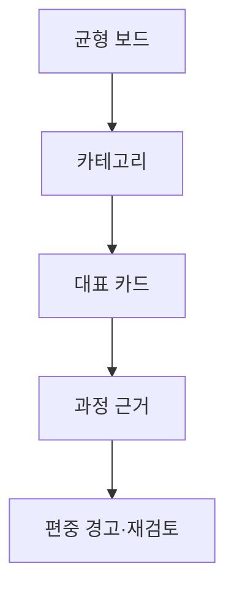

# VC-48 태린 사이트구조맵 B안 V3 — 카테고리 균형 보드형

## 1. Client·REQ 추적
- Client: VC-48 태린, REQ-048.
- 수용 조건: 각 대표가 어떤 요구·카테고리를 대표하는지 설명한다.
- 연결 제품: PROD-029 — 대표 15개 선정 보드 / PROD-059 — 제품 생성·수정 과정 카드 / PROD-098 — 대표 제품 균형 점검표.

## 2. 구조 전략
- 카테고리별 대표 수·근거·미대표 영역을 보드로 비교한다.
- 편중 시 경고하고 사용자가 후보를 다시 검토한다.

## 3. 페이지·콘텐츠·기능 계약
- PAGE-001 대표 레일, PAGE-021 전체 카테고리, 과정 카드.
- 범위·대표 이유·균형 상태·가상 고지·복귀를 제공한다.

## 4. 사용자 흐름·상태
- 균형 보드 → 카테고리 선택 → 대표 카드 → 과정 근거.
- 상태: 균형, 편중, 미대표, 검토 중, 보류·오류.

## 5. 중복·끊김·가정 검증
- 균형 점검은 인기도나 취향 순위가 아니다.
- 생성·수정 카드는 대표 선정 근거와 연결한다.

## 6. Mermaid

## 7. 판정
- CANDIDATE / HYPOTHESIS: 카테고리 편중과 대표 이유의 설명 가능성을 확인한다.

