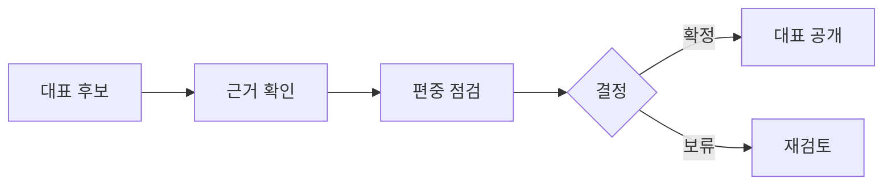

# VC-48 태린 사이트구조맵 C안 V3 — 검토 보류 안전형

## 1. Client·REQ 추적
- Client: VC-48 태린, REQ-048.
- 실패 조건: 인기·베스트·디자인 취향으로만 선정한다.
- 연결 제품: PROD-029 — 대표 15개 선정 보드 / PROD-059 — 제품 생성·수정 과정 카드 / PROD-098 — 대표 제품 균형 점검표.

## 2. 구조 전략
- 근거가 부족하거나 카테고리 편중이 있으면 대표 확정을 보류한다.
- 가상 제품 상태와 검토 이력을 공개한다.

## 3. 페이지·콘텐츠·기능 계약
- PAGE-001 대표 후보, PAGE-021 전체 후보·카테고리, 과정 주석.
- 보류 사유, 근거 요청, 재검토, 원래 위치 복귀를 제공한다.

## 4. 사용자 흐름·상태
- 대표 후보 → 근거 확인 → 편중 점검 → 확정/보류.
- 상태: 후보, 확인, 편중, 보류, 확정, 오류·HOLD.

## 5. 중복·끊김·가정 검증
- 대표 보드는 순위를 뜻하지 않으며 가상 제품임을 계속 표시한다.
- 보류된 후보와 이유를 삭제하지 않는다.

## 6. Mermaid

## 7. 판정
- CANDIDATE / HYPOTHESIS: 근거 없는 대표 선정을 보류하고 검토 경로를 남긴다.

