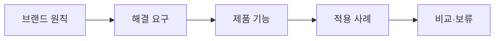

# VC-49 윤재 사이트구조맵 A안 V3 — 원칙·제품 연결형

## 1. Client·REQ 추적
- Client: VC-49 윤재(브랜드와 제품의 일관성), REQ-049.
- 요구: 제품 하나가 브랜드 원칙을 어떻게 실천하는지 설명한다.
- 연결 제품: PROD-028 — 브랜드 원칙 사례 카드 / PROD-058 — 브랜드 원칙·Client 연결 지도 / PROD-097 — 브랜드 원칙 적용 노트.

## 2. 구조 전략
- 브랜드 원칙·해결 요구·제품 기능을 한 연결선으로 보여준다.
- 추상 슬로건과 이미지만 나란히 두지 않고 적용 근거를 명시한다.

## 3. 페이지·콘텐츠·기능 계약
- PAGE-001 진입, PAGE-020 원칙, PAGE-021 제품 상세·비교.
- 사례 카드, 연결 지도, 적용 노트, 보류·복귀를 제공한다.

## 4. 사용자 흐름·상태
- 원칙 선택 → 제품 연결 → 적용 사례 → 차이 비교.
- 상태: 원칙 확인, 연결됨, 근거 부족, 비교, 보류·오류.

## 5. 중복·끊김·가정 검증
- 사례 카드는 사례, 연결 지도는 관계, 적용 노트는 실행 근거를 담당한다.
- 감성 이름만으로 제품 차이를 확정하지 않는다.

## 6. Mermaid

## 7. 판정
- CANDIDATE / HYPOTHESIS: 브랜드 원칙과 제품 실천의 일관성을 검증한다.

