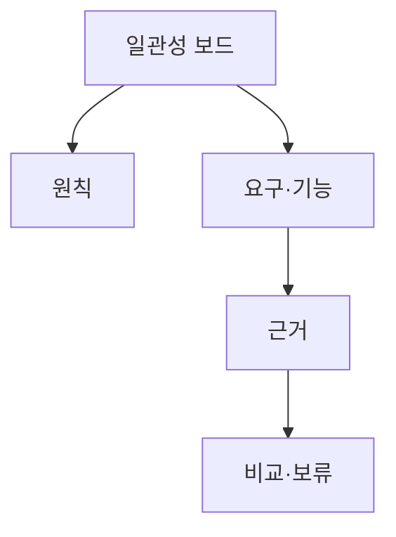

# VC-49 윤재 사이트구조맵 B안 V3 — 일관성 대조 보드형

## 1. Client·REQ 추적
- Client: VC-49 윤재, REQ-049.
- 수용 조건: 제품 하나가 브랜드 원칙을 어떻게 실천하는지 설명한다.
- 연결 제품: PROD-028 — 브랜드 원칙 사례 카드 / PROD-058 — 브랜드 원칙·Client 연결 지도 / PROD-097 — 브랜드 원칙 적용 노트.

## 2. 구조 전략
- 원칙·요구·기능·근거를 열로 나눠 제품별로 대조한다.
- 근거가 빈칸이면 보류하고 이미지나 슬로건으로 보완하지 않는다.

## 3. 페이지·콘텐츠·기능 계약
- PAGE-020 대조 보드, PAGE-021 제품 비교, PAGE-001 진입.
- 출처·확인일·미확정 상태·복귀를 제공한다.

## 4. 사용자 흐름·상태
- 대조 보드 → 제품 선택 → 원칙·기능 확인 → 비교/보류.
- 상태: 대조 중, 일관, 불일치, 근거 부족, 보류·복귀.

## 5. 중복·끊김·가정 검증
- 연결 지도와 적용 노트가 같은 주장을 중복 확정하지 않도록 역할을 분리한다.
- 제품명·이미지보다 해결 요구와 기능 근거를 우선한다.

## 6. Mermaid

## 7. 판정
- CANDIDATE / HYPOTHESIS: 제품과 브랜드 원칙의 근거 일치를 행 단위로 검증한다.

