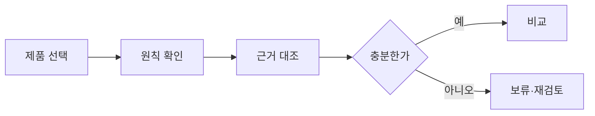

# VC-49 윤재 사이트구조맵 C안 V3 — 근거 부족 보류형

## 1. Client·REQ 추적
- Client: VC-49 윤재, REQ-049.
- 실패 조건: 추상 슬로건과 제품 이미지만 나란히 배치한다.
- 연결 제품: PROD-028 — 브랜드 원칙 사례 카드 / PROD-058 — 브랜드 원칙·Client 연결 지도 / PROD-097 — 브랜드 원칙 적용 노트.

## 2. 구조 전략
- 제품 근거가 부족하면 원칙 연결을 보류하고 확인 질문·출처를 요청한다.
- 검증된 적용만 제품 비교에 사용한다.

## 3. 페이지·콘텐츠·기능 계약
- PAGE-001 원칙 요약, PAGE-020 근거, PAGE-021 제품·보류.
- 미확정 라벨, 원문 보기, 재검토·복귀를 제공한다.

## 4. 사용자 흐름·상태
- 제품 선택 → 원칙 확인 → 근거 대조 → 확정/보류.
- 상태: 후보, 확인됨, 근거 부족, 보류, 확정, 오류·HOLD.

## 5. 중복·끊김·가정 검증
- 적용 노트가 없는 제품은 원칙 실천으로 단정하지 않는다.
- 보류된 연결과 이유를 삭제하지 않는다.

## 6. Mermaid

## 7. 판정
- CANDIDATE / HYPOTHESIS: 근거 없는 일관성 주장을 보류하고 검증 경로를 남긴다.

