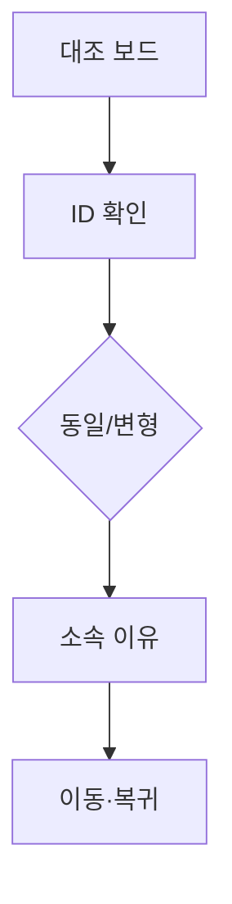

# VC-50 아인 사이트구조맵 B안 V3 — 동일·변형 대조 보드형

## 1. Client·REQ 추적
- Client: VC-50 아인, REQ-050.
- 수용 조건: 같은 제품과 다른 변형을 구분하고 포함 이유를 설명한다.
- 연결 제품: PROD-030 — 카테고리 경계 안내 카드 / PROD-060 — 다중 카테고리 이동 카드 / PROD-100 — 전체 후보군 방향 보드.

## 2. 구조 전략
- ID·변형·카테고리·소속 이유를 열로 나눠 제품별로 대조한다.
- 중복 제품은 한 행으로 합치고 변형만 하위 정보로 표시한다.

## 3. 페이지·콘텐츠·기능 계약
- PAGE-021 대조 보드, 전체 후보 방향, 경계 안내.
- 현재 위치, 소속 이유, 변형, 이동·복귀를 제공한다.

## 4. 사용자 흐름·상태
- 대조 보드 → 제품 선택 → 동일/변형 확인 → 카테고리 이동.
- 상태: 동일, 변형, 주 소속, 보조 소속, 보류·오류.

## 5. 중복·끊김·가정 검증
- 다중 카테고리 이동 카드는 경로를 제공하되 제품을 복제하지 않는다.
- 이름·이미지 변경만으로 새 Product ID를 만들지 않는다.

## 6. Mermaid

## 7. 판정
- CANDIDATE / HYPOTHESIS: 동일성과 변형을 행 단위로 확인한다.

