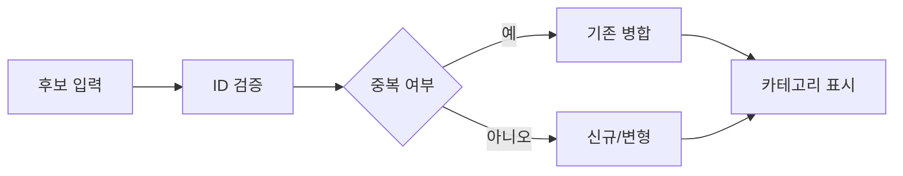

# VC-50 아인 사이트구조맵 C안 V3 — 중복 제거 안전형

## 1. Client·REQ 추적
- Client: VC-50 아인, REQ-050.
- 실패 조건: 이름·이미지만 바꿔 중복 제품을 새 후보로 계산한다.
- 연결 제품: PROD-030 — 카테고리 경계 안내 카드 / PROD-060 — 다중 카테고리 이동 카드 / PROD-100 — 전체 후보군 방향 보드.

## 2. 구조 전략
- Product ID를 먼저 검증하고 중복이면 기존 항목으로 병합한다.
- 분류 근거가 부족하면 보류하고 임의 카테고리를 부여하지 않는다.

## 3. 페이지·콘텐츠·기능 계약
- PAGE-021 후보 검증, 카테고리 경계, 전체 보드.
- 병합 이유, 변형 표시, 보류·재검토·복귀를 제공한다.

## 4. 사용자 흐름·상태
- 후보 입력 → ID 검증 → 병합/변형/신규 → 카테고리 표시.
- 상태: 검증 중, 병합, 변형, 신규, 보류, 오류·HOLD.

## 5. 중복·끊김·가정 검증
- 전체 방향 보드는 병합 후 실제 범위를 반영한다.
- 카테고리 이동만으로 중복 행을 생성하지 않는다.

## 6. Mermaid

## 7. 판정
- CANDIDATE / HYPOTHESIS: 중복 수량을 제거하고 분류 근거를 남긴다.

