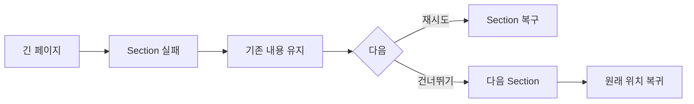

# VC-51 이솔 사이트구조맵 A안 V3 — Section 부분 실패 격리형

## 1. Client·REQ 추적
- Client: VC-51 이솔(저연결성 긴 페이지 복귀), REQ-051.
- 요구: 실패한 Section을 제외하고 확인한 내용·현재 위치를 유지한 채 탐색을 계속한다.
- 연결 제품: PROD-020 — 저연결성 기록 카드 / PROD-050 — 이미지 실패 비교표 / PROD-086 — 카드 오류 대체 템플릿 / PROD-088 — 오프라인 복귀 메모.

## 2. 구조 전략
- Section 단위 Error·Offline·Resume을 격리하고 전체 페이지를 오류로 바꾸지 않는다.
- 텍스트 대안, 재시도, 건너뛰기, 원래 위치 복귀를 제공한다.

## 3. 페이지·콘텐츠·기능 계약
- PAGE-001 긴 랜딩, PAGE-021 제품·카테고리.
- 확인한 내용, 실패 Section, 현재 위치, 재시도·건너뛰기·복귀를 표시한다.

## 4. 사용자 흐름·상태
- 긴 페이지 → Section 실패 → 기존 내용 유지 → 텍스트 대안/건너뛰기 → 복귀.
- 상태: 정상, 지연, Section Error, Offline, Resume, 보류.

## 5. 중복·끊김·가정 검증
- 오프라인 메모는 복귀 위치와 선택을 저장하며 전체 동기화를 보장하지 않는다.
- 자동 새로고침으로 스크롤·선택을 초기화하지 않는다.

## 6. Mermaid

## 7. 판정
- CANDIDATE / HYPOTHESIS: 부분 실패 격리와 위치 복귀를 검증한다.

