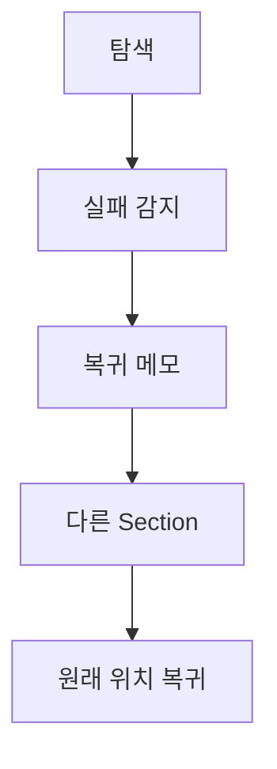

# VC-51 이솔 사이트구조맵 B안 V3 — 복귀 메모 보드형

## 1. Client·REQ 추적
- Client: VC-51 이솔, REQ-051.
- 수용 조건: 실패한 부분을 제외하고 브랜드와 제품 탐색을 계속한다.
- 연결 제품: PROD-020 — 저연결성 기록 카드 / PROD-050 — 이미지 실패 비교표 / PROD-086 — 카드 오류 대체 템플릿 / PROD-088 — 오프라인 복귀 메모.

## 2. 구조 전략
- 현재 Section·읽은 내용·선택·실패 상태를 복귀 메모에 기록한다.
- 재시도와 건너뛰기를 분리하고 자동 새로고침을 금지한다.

## 3. 페이지·콘텐츠·기능 계약
- PAGE-001 위치 메모, PAGE-021 제품 카테고리.
- 텍스트 대안, 실패 범위, 복귀 지점, 재시도·보류를 제공한다.

## 4. 사용자 흐름·상태
- 탐색 → 실패 감지 → 메모 저장 → 다른 Section → 원래 위치 복귀.
- 상태: 탐색 중, 실패 기록, 대체 보기, 복귀 가능, Offline, 오류.

## 5. 중복·끊김·가정 검증
- 비교표와 오류 템플릿은 실패 정보를 보완하고 내용을 삭제하지 않는다.
- 복귀 메모는 선택·위치를 보존하되 동기화 성공을 과장하지 않는다.

## 6. Mermaid

## 7. 판정
- CANDIDATE / HYPOTHESIS: 저연결성에서 탐색 연속성과 복귀 가능성을 확인한다.

