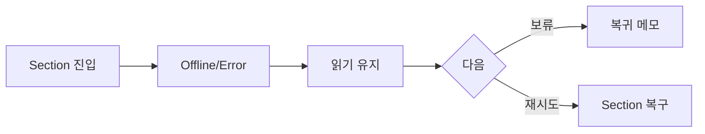

# VC-51 이솔 사이트구조맵 C안 V3 — 오프라인 보류 안전형

## 1. Client·REQ 추적
- Client: VC-51 이솔, REQ-051.
- 실패 조건: 전체 페이지를 빈 오류 화면으로 대체하거나 자동 새로고침한다.
- 연결 제품: PROD-020 — 저연결성 기록 카드 / PROD-050 — 이미지 실패 비교표 / PROD-086 — 카드 오류 대체 템플릿 / PROD-088 — 오프라인 복귀 메모.

## 2. 구조 전략
- Offline·Error에서는 기존 내용을 읽기 전용으로 유지하고 실패 Section만 보류한다.
- 복귀 메모와 재시도 버튼을 제공한다.

## 3. 페이지·콘텐츠·기능 계약
- PAGE-001 상태 안내, PAGE-021 제품·카테고리.
- 보류 이유, 텍스트 대안, 재시도, 현재 위치·복귀를 제공한다.

## 4. 사용자 흐름·상태
- Section 진입 → Offline/Error → 읽기 유지 → 보류/재시도 → 복귀.
- 상태: 읽기 유지, 실패 Section, 보류, 재시도, Resume, 오류·HOLD.

## 5. 중복·끊김·가정 검증
- 오류 화면이 확인한 브랜드·제품 정보를 덮어쓰지 않는다.
- 보류 후에도 원래 Section과 선택 상태를 보존한다.

## 6. Mermaid

## 7. 판정
- CANDIDATE / HYPOTHESIS: 오프라인에서도 확인 내용과 복귀 위치를 보호한다.

